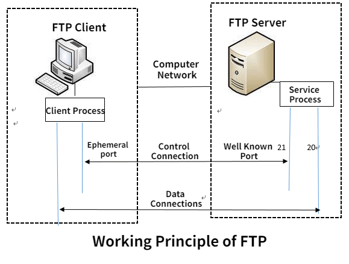
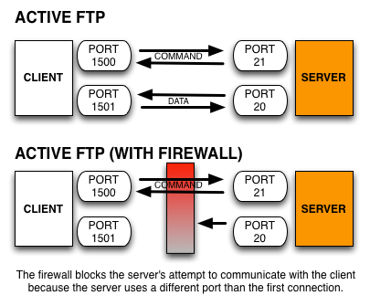
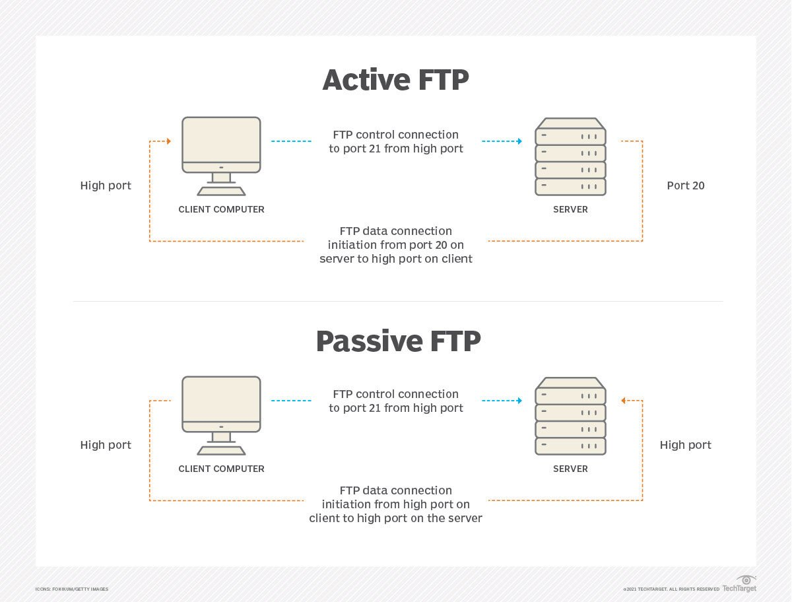

# 20/21 PORTS

<figure><figcaption></figcaption></figure>

So What\`s FTP ???

Ports 20 and 21: File Transfer Protocol (FTP). FTP is for transferring files between a client and a server

how does FTP WORK ??

<figure><figcaption>
how does ftp works
</figcaption></figure>

<figure><figcaption></figcaption></figure>

**more details :)??**

<figure><figcaption></figcaption></figure>

## FTP PENETRATION TESTING&#x20;

* [ ] **Information Gathering:**

<!---->

* Identify the FTP server's version and configuration.
* Determine if anonymous login is enabled.
* Gather information about the network infrastructure, such as firewalls and IDS/IPS

<!---->

* [ ] **Enumeration:**

<!---->

* Enumerate FTP users, directories, and files.
* Identify access controls and permissions.
* Determine if any vulnerable services are running on the server

<!---->

* [ ] **Authentication Testing:**

<!---->

* Test default credentials.
* Attempt dictionary attacks against user accounts.
* Test for weak password policies.

<!---->

* [ ] **FTP Service Configuration:**

<!---->

* Check for misconfigured permissions on directories and files.
* Verify if SSL/TLS is properly configured for secure data transmission.
* Test for the presence of banner grabbing and if it reveals sensitive information.

<!---->

* [ ] **Data Transmission Security:**

<!---->

* Test for plaintext transmission of credentials.
* Verify that data transfers are encrypted using secure protocols.
* Ensure proper handling of sensitive data during transmission.

<!---->

* [ ] **Common Vulnerabilities and Misconfigurations:**

<!---->

* Test for directory traversal vulnerabilities.
* Check for weak encryption algorithms.
* Test for buffer overflow vulnerabilities.
* Verify if server software is up to date with the latest security patches

<!---->

* [ ] **Access Controls:**

<!---->

* Test for bypassing access controls.
* Verify if access controls are properly enforced for different user roles.
* Test for privilege escalation vulnerabilities.

<!---->

* [ ] **Logging and Monitoring:**

<!---->

* Check if FTP server logs are generated and properly configured.
* Verify if logs capture failed login attempts, file transfers, and other relevant activities.
* Test log tampering and evasion techniques.

<!---->

* [ ] **Denial of Service (DoS) Testing:**

<!---->

* Test the server's resilience against DoS attacks.
* Verify if the server throttles or blocks excessive login attempts.
* Test for resource exhaustion vulnerabilities

<!---->

* [ ] **FTP Client Testing:**

<!---->

* Test client-side vulnerabilities that could be exploited to compromise the server.
* Verify if secure FTP clients are used to connect to the server.

<!---->

* [ ] **Post-Exploitation Testing:**

<!---->

* Test for persistence mechanisms after successful exploitation.
* Verify if sensitive data can be exfiltrated or manipulated.
* Test for data integrity and confidentiality after exploitation.

<!---->

* [ ] **Reporting:**

<!---->

* Document all findings, including vulnerabilities and their severity.
* Provide recommendations for remediation.
* Prioritize vulnerabilities based on risk impact.

