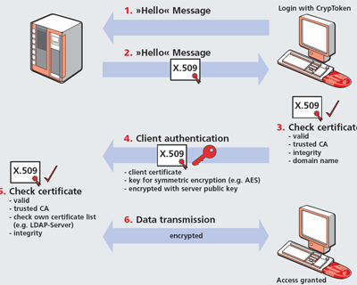

# 80/443 PORT

<figure><figcaption>
Http(port 80) Process between Client And Sever
</figcaption></figure>

<figure><figcaption>
Https(port 443) Process between Client and Sever 
</figcaption></figure>

## Simple CheckList for 80 port

1-Scan the port with nmap to detect the web server version and vulnerabilities

2- Use cadaver to access the WebDAV service and upload malicious files or execute commands

3-  Use EternalBlue to exploit SMBv1 vulnerabilities on older Microsoft computers

4- Capture or brute-force NTLM hashes or SMB login credentials

