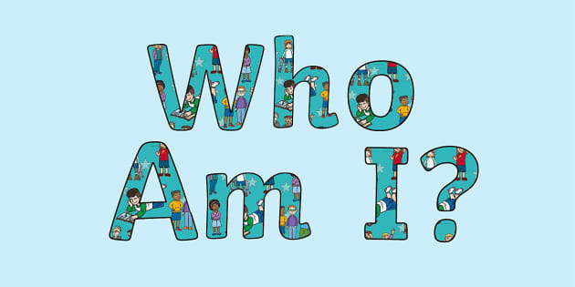
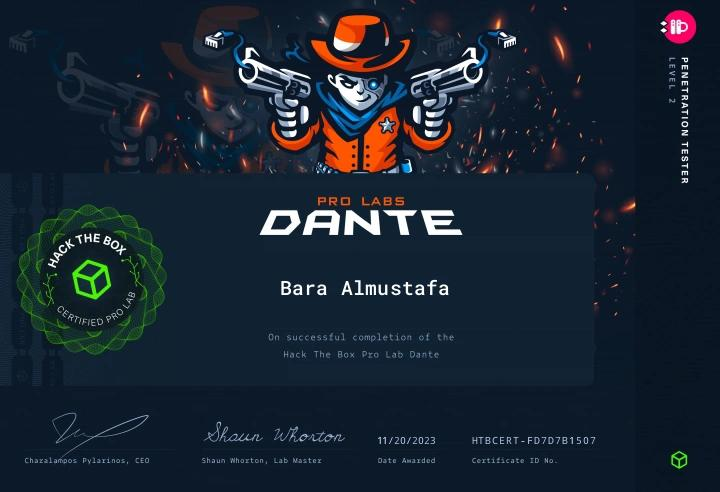

# Whoami ??

<figure><figcaption></figcaption></figure>

My name is Bara Almustafa(aka 0xCyberSoldier) , I\`m from Jordan , i Studying Networking Systems and Security Engineering ,  I can speak 3 languages&#x20;

* Arabic: Native
* English : Professional&#x20;
* Japanese : Beginner&#x20;

I\`m enthusiastic on cybersecurity specifically on Offensive Security ( Rea Teaming ,  Penetration Testing  , Bug Bounty HUNTING , CTF (Capture The Flag)&#x20;

MY Certifications :&#x20;

* CNSP (Certified Network Security Practitioner)
* HACK THE BOX Dante Level 2&#x20;
* CCNA 200-301&#x20;
* ejpt&#x20;

&#x20;here is example of my certifications&#x20;

<figure><figcaption>
My Certification of Hack the box Dante Level 2 
</figcaption></figure>

